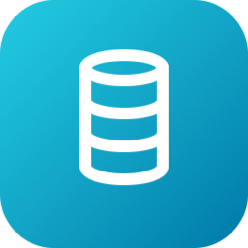
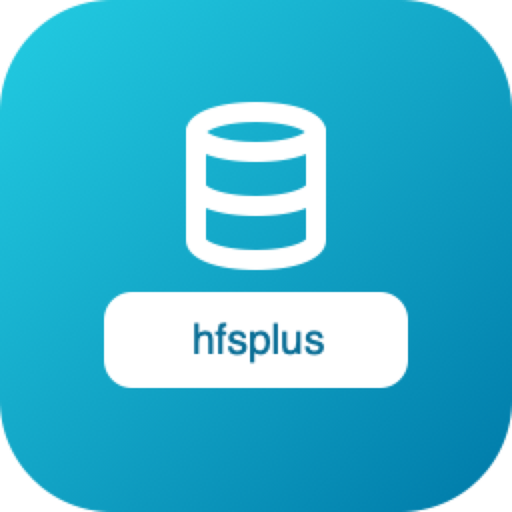
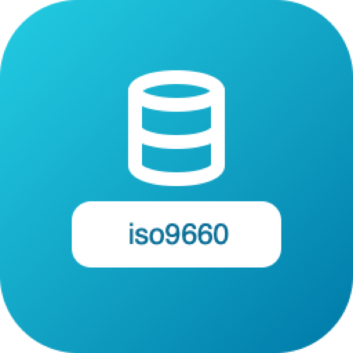
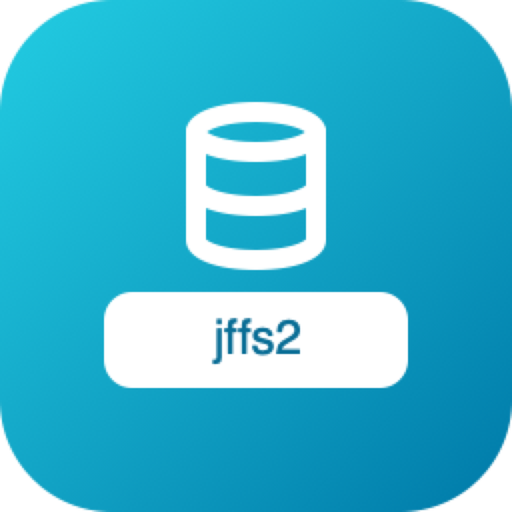
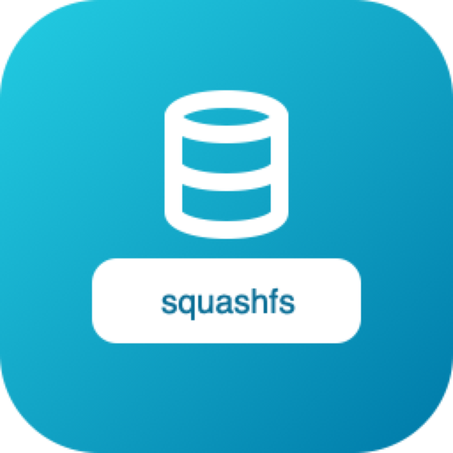
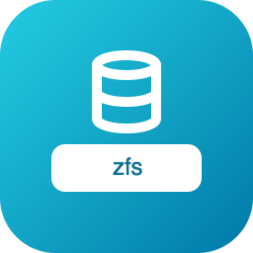

# go-filesystems — brand assets

Official logos for the **go-filesystems** organization.

## Formats

- **SVG** — `svg/color`, `svg/white` (white, transparent), `svg/black` (black, transparent)
- **PNG** 16→1024 px, 3 variants — `png/<variant>/<size>/`
- **JPG** (color, white background) — `jpg/<size>/`
- **ICO** (Windows) — `ico/`
- **ICNS** (macOS) — `icns/`
- **GitHub avatar** 512 px — `avatar/`

## Repos (35)

| | repo |
|---|---|
|  | `9p` |
|  | `afs` |
|  | `apfs` |
|  | `bcachefs` |
|  | `btrfs` |
|  | `ceph` |
|  | `cifs` |
|  | `cramfs` |
|  | `erofs` |
|  | `exfat` |
|  | `ext2` |
|  | `ext3` |
|  | `ext4` |
|  | `f2fs` |
|  | `fat32` |
|  | `ffs` |
|  | `glusterfs` |
|  | `hfsplus` |
|  | `iso9660` |
|  | `jffs2` |
|  | `jfs` |
|  | `minix` |
|  | `nfs` |
|  | `ntfs` |
|  | `reiserfs` |
|  | `smb` |
|  | `squashfs` |
|  | `ubifs` |
|  | `udf` |
|  | `ufs` |
|  | `ufs2` |
|  | `vfat` |
|  | `xfs` |
|  | `yaffs2` |
|  | `zfs` |

---
*Auto-generated assets — rounded square badge, line glyph, color / white / black variants.*
